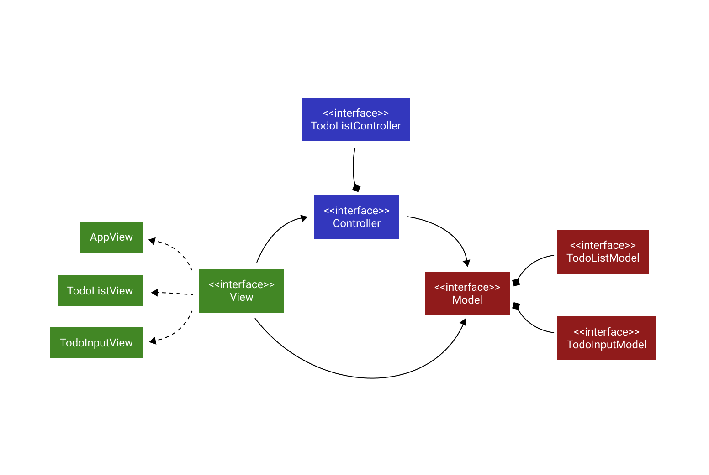

# javafx-todo

A toy example of a Todo application using [JavaFX](https://openjfx.io/index.html).

## Architecture

This example employs the Model-View-Controller architecture. See the UML below for more details.

